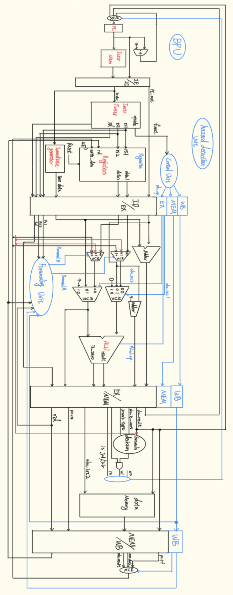

# A Simple RV32I Pipeline CPU

- This project is a RISC-V CPU implementation by Rax for learning pipeline CPU architecture.
- The current goal is to run a small RV32I program in an end-to-end simulation on this CPU.
- Work in progress: the branch prediction unit and cache are not completed yet.


## 1 Install Tools (Ubuntu / Debian)
```bash
sudo apt update
sudo apt install -y iverilog gtkwave

iverilog -V
gtkwave --version
```

## 2 Create Common Directories
```bash
mkdir -p build wave testcase
```

## 3 Compile and Run Simulation
Verilog source files are located in `src/`. Use the following commands to compile and run:

```bash
find src -maxdepth 1 -name "*.v" | sort | xargs iverilog -g2012 -I src -s CPU_tb -o build/cpu_sim
vvp build/cpu_sim
```

If you prefer an explicit top/testbench command:
```bash
iverilog -g2012 -I src -s CPU_tb -o build/cpu_sim src/*.v
vvp build/cpu_sim
```

## 4 Use a Hex `.txt` Program Input
Prepare an instruction file in `$readmemh` format (one 32-bit hex instruction per line):
```bash
cat > testcase/program2.txt <<'EOT'
00100093
00200113
002081B3
EOT
```

Then recompile and run:
```bash
iverilog -g2012 -I src -s CPU_tb -o build/cpu_sim src/*.v
vvp build/cpu_sim
```

## 5 Waveform Debugging (GTKWave)
After simulation, if your testbench generates a VCD file (for example `wave/cpu.vcd`):

```bash
gtkwave wave/cpu.vcd
```

One-line flow:
```bash
iverilog -g2012 -I src -s CPU_tb -o build/cpu_sim src/*.v && vvp build/cpu_sim && gtkwave wave/cpu.vcd
```

## 6 Common Issues
- `No top level modules`: The top/testbench module declaration is missing or incomplete.
- `Unable to open input file`: Usually a wrong path to `testcase/program2.txt`.
- No waveform file: Make sure your testbench dumps VCD (for example `$dumpfile/$dumpvars`).

## 7 To-Do
- Branch_predictor.v


## 8 Completed Files
- Adder.v
- ALU.v
- Branch_Comparator.v
- Control_Unit.v
- Data_Memory.v
- Execution.v
- Forwarding_Unit.v
- Hazard_detection.v
- Immediate_Generator.v
- Instruction_Decode.v
- Instruction_Fetch.v
- Instruction_Memory.v
- Instruction_Parser.v
- Memory.v
- Mux2.v
- Mux3.v
- Program_Counter.v
- Register_File.v

## References
- David A. Patterson and John L. Hennessy, *Computer Organization and Design: The Hardware/Software Interface (RISC-V Edition)*, Morgan Kaufmann.
